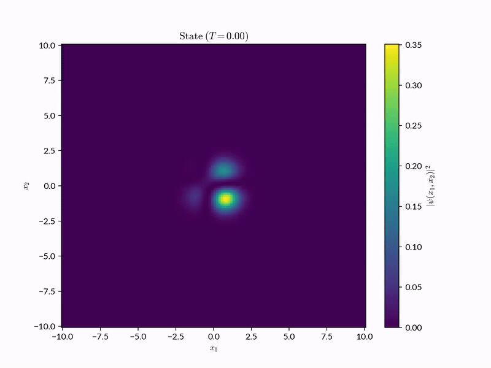
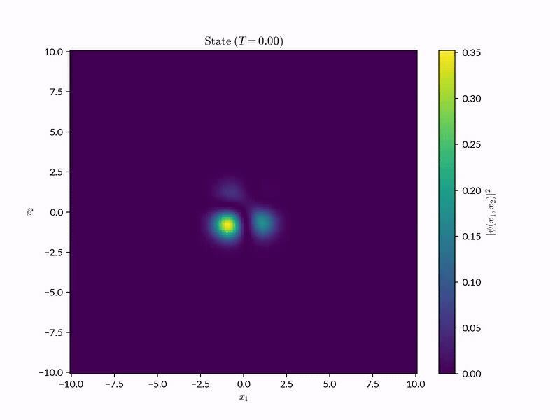

# QuEvolutio
<p align="justify">
QuEvolutio is a package for evolving (propagating) quantum states with respect
to the time-dependent Schrödinger equation (TDSE).
<!--><!-->
It offers different propagation schemes which can be used to propagate
n-dimensional states in both time-independent and time-dependent quantum
systems.
</p>

```math
i\hbar \frac{\partial\psi(\mathbf{r},t)}{\partial t} =
\hat{H}(\mathbf{r}, t)\psi(\mathbf{r},t)
```

## Contents
- [QuEvolutio](#quevolutio)
  - [Contents](#contents)
  - [Installation](#installation)
  - [Usage](#usage)
  - [Examples](#examples)
    - [Harmonic Oscillator: Standard](#harmonic-oscillator-standard)
      - [Superposed States - 1D](#superposed-states---1d)
      - [Superposed States - 2D](#superposed-states---2d)
    - [Harmonic Oscillator: Driven](#harmonic-oscillator-driven)
      - [Superposed States - 1D](#superposed-states---1d-1)
      - [Superposed States - 2D](#superposed-states---2d-1)
  - [Tests](#tests)
  - [Structure](#structure)
  - [References](#references)

> [!NOTE]
> The documentation for QuEvolutio is a work in progress.

## Installation
<p align="justify">
QuEvolutio is in the process of being published on <code>PyPI</code>
(documentation pending).
<!--><!-->
In the mean time, it can be cloned and a local editable install can be
performed with <code>pip</code>, using the following commands.
</p>

```
$ git clone git@github.com:Pavan365/QuEvolutio.git
$ cd QuEvolutio/
$ pip install -e .
```

+ For installing with developer dependencies (required for examples and tests).

```
$ git clone git@github.com:Pavan365/QuEvolutio.git
$ cd QuEvolutio/
$ pip install -e .[dev]
```

> [!NOTE]
> It is recommended to perform installation within a Python environment.

## Usage
<p align="justify">
Documentation that gives a comprehensive overview of how QuEvolutio can be used
is under development.
<!--><!-->
In the mean time, the example scripts in the <code>examples</code> directory
give a complete overview of how to set up simulations for each of the
available propagation schemes from scratch.
<!--><!-->
Below, the various propagation schemes available in QuEvolutio are listed along
with the corresponding classes that implement them.
</p>

<table align="center" style="text-align: center;">
  <thead>
    <tr>
      <th>Propagation Scheme</th>
      <th>Dimensionality</th>
      <th>QuEvolutio Class</th>
    </tr>
  </thead>
  <tbody>
    <tr>
      <td>Chebyshev</td>
      <td>ND</td>
      <td><code>Chebyshev</code></td>
    </tr>
    <tr>
      <td>Semi-Global</td>
      <td>ND</td>
      <td><code>SemiGlobal</code></td>
    </tr>
    <tr>
      <td>Split-Operator</td>
      <td>ND</td>
      <td><code>SplitOperator</code></td>
    </tr>
    <tr>
      <td>Crank-Nicolson</td>
      <td>1D</td>
      <td><code>CrankNicolson1D</code></td>
    </tr>
  </tbody>
</table>

> [!NOTE]
> For time-dependent systems, it is recommended to use the Semi-Global
propagation scheme.

## Examples
<p align="justify">
The <code>examples</code> directory contains example simulation scripts for
each available propagation scheme, using both the standard and driven harmonic
oscillator systems.
<!--><!-->
Most of these examples are set up to propagate the ground state of the
respective system across 10 time units using natural units, but these can be
customised as required.
<!--><!-->
For example, the initial state could be changed from a ground state to an
excited state, the units of the system could be changed, etc.
<!--><!-->
Below are some examples of propagating superposed excited states in the
standard and driven harmonic oscillator systems, in both one and two
dimensions.
</p>

> [!NOTE]
> These examples use natural units where: $\hbar = m = \omega = 1$.

> [!IMPORTANT]
> [FFmpeg](https://www.ffmpeg.org/) should be installed when using the examples
in this codebase as it required for generating animations.

### Harmonic Oscillator: Standard
#### Superposed States - 1D
+ Propagating the superposition of the second and fourth excited states of the
standard harmonic oscillator in one dimension, using the `Chebyshev`
propagator.

```math
\hat{H}(x) =
\frac{\hat{p}_{x}^{2}}{2m} +
\frac{1}{2}m\omega^{2}\hat{x}^{2}
```

<p align="center">
  
</p>

#### Superposed States - 2D
+ Propagating the superposition of the second and fifth excited states of the
standard harmonic oscillator in two dimensions, using the `SplitOperator`
propagator.

```math
\hat{H}(x,y) =
\frac{\hat{p}_{x}^{2}}{2m} +
\frac{\hat{p}_{y}^{2}}{2m} +
\frac{1}{2}m\omega^{2}(\hat{x}^{2} + \hat{y}^{2})
```

<p align="center">
  
</p>

### Harmonic Oscillator: Driven
#### Superposed States - 1D
+ Propagating the superposition of the second and fourth excited states of the
driven harmonic oscillator in one dimension, using the `SemiGlobal` propagator.

```math
\hat{H}(x,t) =
\frac{\hat{p}_{x}^{2}}{2m} +
\frac{1}{2}m\omega^{2}\hat{x}^{2} +
\hat{x}\sin(t)
```

<p align="center">
  
</p>

#### Superposed States - 2D
+ Propagating the superposition of the second and fifth excited states of the
driven harmonic oscillator in two dimensions, using the `SemiGlobal`
propagator.

```math
\hat{H}(x,y,t) =
\frac{\hat{p}_{x}^{2}}{2m} +
\frac{1}{2}m\omega^{2}(\hat{x}^{2} + \hat{y}^{2})+
(\hat{x} + \hat{y})\sin(t)
```

<p align="center">
  
</p>

## Tests
<p align="justify">
This codebase contains tests for the mathematical functions used by the
various propagators, defined in the <code>quevolutio.mathematical</code>
module.
<!--><!-->
These tests are found in the <code>tests</code> directory and can be run
with <code>pytest</code>, which is included in the developer dependencies,
using the following commands.
</p>

```
$ cd tests/
$ pytest
```

## Structure
```
.
├── LICENSE
├── README.md
├── docs
├── examples
│   ├── chebyshev
│   │   ├── driven_ho_1d.py
│   │   ├── standard_ho_1d.py
│   │   └── standard_ho_2d.py
│   ├── crank_nicolson
│   │   ├── driven_ho_1d.py
│   │   └── standard_ho_1d.py
│   ├── semi_global
│   │   ├── driven_ho_1d.py
│   │   ├── driven_ho_2d.py
│   ├── split_operator
│   │   ├── driven_ho_1d.py
│   │   ├── standard_ho_1d.py
│   │   └── standard_ho_2d.py
│   └── utils
│       ├── __init__.py
│       ├── numerical.py
│       ├── standard_ho.py
│       └── visualisation.py
├── pyproject.toml
├── quevolutio
│   ├── __init__.py
│   ├── core
│   │   ├── __init__.py
│   │   ├── aliases.py
│   │   ├── domain.py
│   │   └── tdse.py
│   ├── mathematical
│   │   ├── __init__.py
│   │   ├── affine.py
│   │   └── approximation.py
│   └── propagators
│       ├── __init__.py
│       ├── chebyshev.py
│       ├── crank_nicolson.py
│       ├── semi_global.py
│       └── split_operator.py
└── tests
    ├── test_affine.py
    └── test_approximation.py
```

## References
+ Schaefer, I., Tal-Ezer, H. and Kosloff, R. (2017) ‘Semi-global approach for propagation of the time-dependent Schrödinger equation for time-dependent and nonlinear problems’, Journal of Computational Physics, 343, pp. 368–413. Available at: https://doi.org/10.1016/j.jcp.2017.04.017.
+ Tal‐Ezer, H. and Kosloff, R. (1984) ‘An accurate and efficient scheme for propagating the time dependent Schrödinger equation’, The Journal of Chemical Physics, 81(9), pp. 3967–3971. Available at: https://doi.org/10.1063/1.448136.
+ Feit, M.D., Fleck, J.A. and Steiger, A. (1982) ‘Solution of the Schrödinger equation by a spectral method’, Journal of Computational Physics, 47(3), pp. 412–433. Available at: https://doi.org/10.1016/0021-9991(82)90091-2.
+ Crank, J. and Nicolson, P. (1947) ‘A practical method for numerical evaluation of solutions of partial differential equations of the heat-conduction type’, Mathematical Proceedings of the Cambridge Philosophical Society, 43(1), pp. 50–67. Available at: https://doi.org/10.1017/S0305004100023197.
